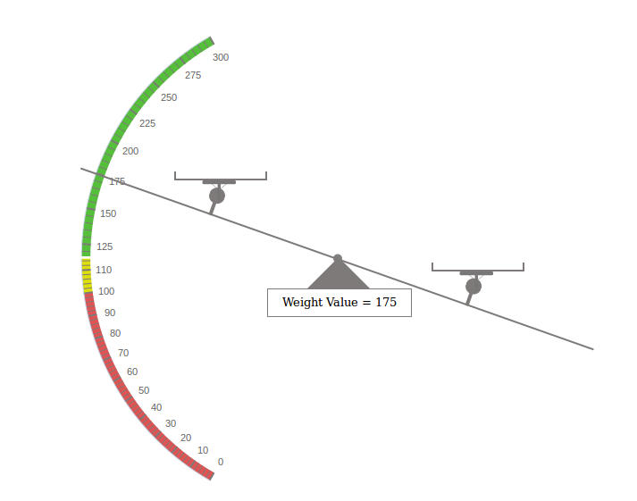

<h1>Weighing Balance Analogue Meter</h1>

This is the jQuery widget for Weighing Balance with Analogue Meter

Demo Image of the Widget

</img>
  
This widget uses GPL-LICENSE.

<h2>How to take the Demo of Weighing Balance Analogue Meter jQuery widget</h2>

<ul>
<li>Just download or take the clone of the repository or click here <a href="https://github.com/hexaviewtech/weighingbalance-jquery-widget" target="_blank">Weighing Balance Analogue Meter</a>  </li>
<li>And Open the file named as: weighingBalance.html in browser.</li>
<li>Now, if you want to change the data value of Weighing Balance or change the code as per your requirement.
  Open the file: weighingBalanceMeter.js , you will find this file in "js" folder.</li>
</ul>

You can make the required changes.

<b>Note:</b> PLEASE FOLLOW THE COMMENTS MENTIONED IN THE FILEs

    

